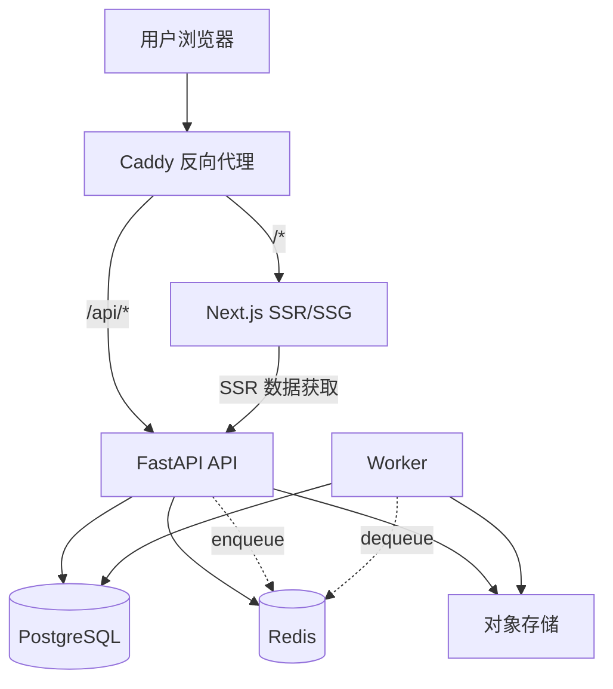
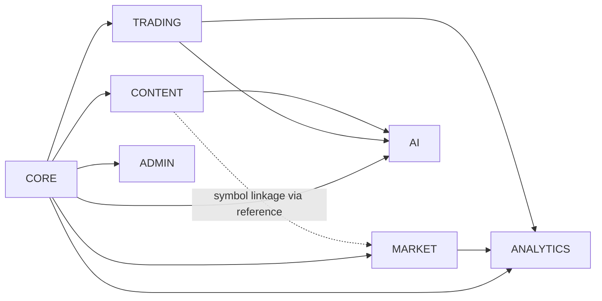

# 平台底座设计文档 — 架构审查报告

> 审查对象：[2026-04-06-platform-foundation-design.md](file:///Users/m4x/Documents/tradingnoobs/docs/superpowers/specs/2026-04-06-platform-foundation-design.md)
> 审查基线：当前代码库 ([models.py](file:///Users/m4x/Documents/tradingnoobs/backend/models.py), [docker-compose.yml](file:///Users/m4x/Documents/tradingnoobs/docker-compose.yml), router/service 层)
> 审查时间：2026-04-06

---

## 一、总体评价

**这份设计文档的质量在同阶段产品中属于上乘。** 一天的讨论能收敛出这样一份 1250 行的架构基线，对一个准备从"能用"走向"可上线"的产品来说，方向判断基本全对。

核心架构决策我完全认同：
- ✅ 模块优先单体，不过早微服务化
- ✅ PostgreSQL schema 做逻辑域隔离
- ✅ 事件真相 + 聚合状态的核心建模
- ✅ 图表 schema-first 解耦渲染器
- ✅ Timescale-ready 而非 Timescale-first
- ✅ 分钟线 active-tracking 而非全量回填

**但我发现了 3 个结构性问题、5 个重要缺失、7 个可改进点。** 下文按影响程度排列。

---

## 二、结构性问题 (必须修正)

### 🔴 S1: 运行时拓扑图有误

文档中的 Mermaid 图 (L46-67) 画的数据流是：

```
User -> Web -> Caddy -> API
```

这是**错误的**。正确的拓扑应该是：



关键差异：
1. **用户直接访问 Caddy**，不是先到 Web 再到 Caddy
2. **Caddy 按路径分流**：`/api/*` → API，`/*` → Next.js
3. **API 与 Worker 之间通过 Redis 队列解耦**（不是 API 直接调用 Worker）
4. 当前你的 [Caddyfile](file:///Users/m4x/Documents/tradingnoobs/Caddyfile) 已经在按路径分流了，文档反而画反了

---

### 🔴 S2: 模块依赖图中 `MARKET → CONTENT` 方向存疑

文档 L104 画了 `MARKET --> CONTENT`，即市场数据依赖内容模块。

这在语义上是反的。应该是 **`CONTENT --> MARKET`**（内容模块需要通过市场数据模块解析新闻中提到的 symbol），或者 **`CONTENT` 与 `MARKET` 共同引用 `REFERENCE`**（通过 `AssetMaster` 做关联）而互不依赖。

建议修正为：



`CONTENT` 对 `MARKET` 的依赖是**弱依赖**（仅查 symbol 映射），应该用虚线或通过 `reference` 层间接关联。

---

### 🔴 S3: 多 Schema 下的 Alembic 迁移策略未定义

文档提议 6 个 PostgreSQL schema (`core`, `reference`, `market`, `derived`, `audit`, `content`)，也强调了必须用 Alembic。但**没有回答 Alembic 如何管理多 schema 的问题**。

这不是小事。实操中有三种路线：

| 方案 | 优点 | 缺点 |
|------|------|------|
| **A. 单 Alembic env，多 schema** | 简单，一条迁移链 | 跨 schema 的依赖和回滚复杂 |
| **B. 每 schema 独立 Alembic env** | 隔离性好，可独立回滚 | 运维复杂，交叉引用困难 |
| **C. 单 env + 按 schema 打 label** | 折中 | 需要自定义 env.py |

> [!IMPORTANT]
> **建议选方案 A**（单 Alembic env）。理由：你是单体部署，6 个 schema 在同一个 PG 实例里，跨 schema FK 是合理的（比如 `market.quote_snapshots` 引用 `reference.asset_master`）。独立 env 反而会让你无法在一个事务里完成跨 schema 迁移。Alembic 的 `include_schemas=True` 配合 `target_metadata` 可以一次扫描所有 schema。

---

## 三、重要缺失 (建议补充到文档)

### 🟡 M1: API 版本策略

文档对图表 schema 和 prompt template 都提出了版本控制要求，但**完全没有提到 REST API 本身的版本策略**。

对一个计划走 B2C、未来要支持 App 客户端的产品来说，这是**第一天就应该定的**。一旦 API 发布后再加版本号，迁移成本极高。

建议：
- URL 前缀 `/api/v1/...` 从 Phase 1 就落地
- 版本策略写入文档的"横切平台能力"章节
- 废弃策略：旧版本至少维持 6 个月并发

---

### 🟡 M2: 限流与滥用防护

文档提到了 Redis 用于"限流辅助"(L78)，但没有任何具体策略。1000 个用户 + AI 端点 = **必须有限流**。

建议至少定义：

| 维度 | 策略 |
|------|------|
| 全局 API | 每用户 100 req/min |
| AI 端点 | 每用户 10 req/hour（或按套餐） |
| 市场数据 | 每用户 60 req/min |
| Auth 端点 | 每 IP 10 req/min（防暴力破解） |
| 导入 | 每用户 5 req/hour |

实现方案：FastAPI middleware + Redis sliding window counter。

---

### 🟡 M3: 实时通信策略

文档说行情更新目标为"分钟级"，但**没有定义前端如何获取更新**。

三个选项：

| 方案 | 适用场景 | 复杂度 |
|------|----------|--------|
| **轮询 (Polling)** | Dashboard 刷新、任务状态 | 低 |
| **SSE** | 任务进度、行情推送 | 中 |
| **WebSocket** | 实时交互、聊天式 AI | 高 |

> [!TIP]
> **建议 V1 用 SSE**。FastAPI 原生支持 `StreamingResponse`，比 WebSocket 简单得多，且足够支撑分钟级行情 + 任务进度推送。仅当未来需要双向通信（比如实时对话式 AI）时，再引入 WebSocket。

---

### 🟡 M4: 数据库连接池策略

文档规划了 API 进程 + Worker 进程同时访问 PostgreSQL，但**没有提到连接池**。

单台 VPS、4 CPU、1000 用户，如果 API 和 Worker 各开自己的连接池，很容易打满 PG 的 `max_connections`（默认 100）。

建议：
- 在 `docker-compose.yml` 中引入 **PgBouncer** 作为连接池代理
- API 和 Worker 都通过 PgBouncer 连接 PG
- PgBouncer 用 `transaction` 模式，而非 `session` 模式
- 这也为未来水平扩展（多 Worker 实例）做好准备

```yaml
# docker-compose.yml 中新增
pgbouncer:
  image: edoburu/pgbouncer
  environment:
    - DATABASE_URL=postgres://postgres:${DB_PASSWORD}@db:5432/tradingnoobs
    - POOL_MODE=transaction
    - MAX_CLIENT_CONN=200
    - DEFAULT_POOL_SIZE=20
```

---

### 🟡 M5: 测试策略完全缺失

设计文档中**没有任何关于测试的讨论**。对一个要上线服务 1000 用户的产品来说，至少应该定义：

| 层次 | 范围 | 工具建议 |
|------|------|----------|
| 单元测试 | Service 层核心逻辑 | pytest |
| 集成测试 | API 端点 + 数据库交互 | pytest + httpx + testcontainers |
| 数据库测试 | 迁移的正向/逆向测试 | Alembic `upgrade` + `downgrade` |
| 前端测试 | 关键交互流程 | Playwright |

建议在"演进路径 Phase 1"中加入"建立测试基础设施"作为硬性要求。

---

## 四、可改进点 (提升收益)

### 💡 I1: Worker 选型建议收窄

文档把异步任务库留到 implementation planning，但这个决策会影响 `job_definitions` / `job_runs` 的表结构设计。建议现在就收窄到 **2 选 1**：

| 方案 | 优势 | 劣势 |
|------|------|------|
| **arq** | asyncio 原生，轻量，Redis-based，与 FastAPI 天然搭配 | 社区较小，功能有限 |
| **自研轻量队列** | 完全可控，PG-backed（减少 Redis 依赖） | 需要自己实现重试、并发控制 |

> [!TIP]
> **我推荐 arq**。理由：你已经引入 Redis，arq 是 Samuel Colvin（pydantic 作者）写的，asyncio 原生，API 极简。在 1000 用户规模下完全够用，且不像 Celery 那样引入 kombu、amqp 等重依赖。
>
> 如果你追求极致简洁且不想多一个第三方库，用 **Redis Streams + 自研 consumer** 也可以，但要自己写 dead-letter、retry、concurrency control。

---

### 💡 I2: Chart Registry 在 V1 可以简化

文档定义了一套完整的 Chart Registry 机制（L607-629），包含 `chart_id`, `domain`, `entity_scope`, `analytics_builder`, `schema_builder`, `renderer_key` 等字段。

这在成熟阶段是对的，但 **V1 阶段图表可能不超过 10 个**，注册表的管理成本可能超过收益。

建议 V1 简化为：

```python
# 用 Python 装饰器做轻量注册，而非数据库表
from typing import Protocol

class ChartBuilder(Protocol):
    chart_type: str
    version: str
    def build(self, params: ChartParams) -> ChartSchema: ...

CHART_REGISTRY: dict[str, ChartBuilder] = {}

def register_chart(builder_cls):
    CHART_REGISTRY[builder_cls.chart_type] = builder_cls()
    return builder_cls

@register_chart
class PnLTimeseriesChart:
    chart_type = "pnl_timeseries"
    version = "1.0"
    def build(self, params): ...
```

等图表数量超过 15-20 个、或者需要动态启停时，再升级为数据库驱动的 registry。

---

### 💡 I3: `derived` 域的刷新策略需要明确

文档定义了 `derived` 域存放 "可重算的读模型"，但**没有回答最关键的问题：什么时候触发重算？**

建议补充一个刷新策略矩阵：

| 物化视图 | 触发条件 | 延迟容忍 |
|----------|----------|----------|
| `portfolio_snapshots` | 每日定时 + 手动触发 | T+1 |
| `dashboard_cache` | 交易事件后异步 | < 5 min |
| `chart_materializations` | 按需 + 缓存 TTL | < 10 min |
| `analysis_results` | AI 任务完成时 | 任务级 |

没有这个矩阵，实现时会出现"到底该同步算还是异步算"的反复讨论。

---

### 💡 I4: 外部依赖的熔断策略

系统依赖至少 4 类外部服务：行情 Provider、AI Provider、IBKR API、内容抓取源。文档提到了 `provider_unavailable` 错误码，但**没有定义熔断和降级策略**。

建议补充：

```
规则：
- 任何 Provider 连续失败 N 次（建议 N=5）后，自动熔断 M 分钟（建议 M=5）
- 熔断期间直接返回 cached/stale 数据 + 标记 data_quality=degraded
- 熔断恢复后自动 fallback 到备用 provider（如已配置）
- 所有熔断事件写入 audit_logs
```

实现上，可以用一个简单的 Redis counter + TTL，不需要引入 circuit breaker 库。

---

### 💡 I5: `users.public_id` 应该是 ULID 而非 UUID

文档建议 `public_id` 用 UUID (L1029)。对于一个交易日志产品，**ULID 比 UUID 更优**：

| 特性 | UUID v4 | ULID |
|------|---------|------|
| 排序 | 不可排序 | 按时间排序 |
| 索引效率 | B-tree 碎片化 | 连续插入友好 |
| 可读性 | 36 字符 | 26 字符 |
| 安全性 | 同等 | 同等 |

ULID 在 PostgreSQL 中可以存为 `uuid` 类型（二进制兼容），用 Python `python-ulid` 库生成。

---

### 💡 I6: `PositionEvent` 表中 `emotion` 和 `confidence` 的位置值得商榷

文档把 `emotion` 和 `confidence` 放在 `PositionEvent` 上 (L389-390)。但实操中，用户更可能是 **在一个开仓决策中记录情绪和信心**，而不是每次加减仓都记录。

两种设计：

| 方案 | 放在 PositionEvent | 放在 TradingPosition |
|------|-------------------|---------------------|
| 粒度 | 每次加减仓 | 每段持仓生命周期 |
| 用户负担 | 高（每次操作都要填） | 低（开仓和复盘时填） |
| 分析价值 | 可以看情绪如何影响加减仓决策 | 可以看整体情绪与盈亏关系 |

> [!NOTE]
> 建议 **两处都保留**，但 `PositionEvent` 上的 `emotion/confidence` 默认为 `nullable` 且 UI 上不强制填写。`TradingPosition` 上新增 `opening_emotion`、`opening_confidence`、`review_emotion` 作为开仓时和复盘时的情绪快照。这样既不增加用户操作负担，又为精细分析留路。

---

### 💡 I7: 建议在 Phase 1 就引入 Structured Logging

文档在"可观测性"部分提到了结构化日志 (L1102)，但没有放进 Phase 1。

这是个**几乎零成本但收益巨大**的改进。建议：

```python
# 用 structlog 替换所有 print()
import structlog
logger = structlog.get_logger()

# 代替 print(f"User {user_id} created position {pos_id}")
logger.info("position_created", user_id=user_id, position_id=pos_id, symbol=symbol)
```

在 Phase 1 就做的理由：
- 当前代码中存在大量 `print()` 和宽泛 `except:`（在 baseline 中已确认）
- 越晚改越痛苦，因为后续所有新模块都会继续用 `print()`
- 结构化日志是后续告警、审计、问题排查的基础

---

## 五、关于 Phase 分期的建议

当前的 5-Phase 分期合理，但我建议对 Phase 1 做一些调整：

### Phase 1 建议增补项

| 增补项 | 理由 |
|--------|------|
| API 版本前缀 `/api/v1/` | 首发后无法回退 |
| PgBouncer 连接池 | Worker 并存后必须 |
| structlog 替换 print | 越早越便宜 |
| 限流 middleware | B2C 产品安全底线 |
| 基础 pytest 骨架 | 至少覆盖 core 层 CRUD |

### Phase 1 建议不做的

| 移到后续的项 | 理由 |
|-------------|------|
| i18n 基础设施 | 1000 用户阶段大概率先只覆盖中英文，key 化可以做但翻译体系不急 |
| Feature flag 表建模 | 用环境变量 + 代码常量即可，等功能多了再升级 |

---

## 六、几个小但值得注意的点

1. **`models.py` L257 有重复的 `currency` 列定义**——这是一个运行时隐患，ORM 可能静默覆盖
2. **`docker-compose.yml` 还没有 Redis 服务**——文档依赖 Redis 但当前部署中不存在
3. **`AssetMetadata` 用 `symbol` 做主键**——文档建议改为 `AssetMaster` + surrogate key，这是对的，string PK 在 join 和索引上都不如 bigint
4. **当前 `TradeBatch.pnl` 只在 EXIT 时计算**——文档的 `PositionEvent` 设计把 `realized_pnl_gross` 和 `realized_pnl_net` 分开，这比现在好很多
5. **文档没有提到 CORS 策略**——当前 `docker-compose.yml` 里 CORS 配置是逗号分隔字符串，需要在 Phase 1 规范化

---

## 七、总结

| 维度 | 评分 | 说明 |
|------|------|------|
| 方向判断 | ⭐⭐⭐⭐⭐ | 每一个核心技术决策都站得住脚 |
| 领域建模 | ⭐⭐⭐⭐⭐ | 事件真相 + 聚合态、TradeInstrument 分层、数据域隔离都很扎实 |
| 完整性 | ⭐⭐⭐⭐ | 缺 API 版本、限流、连接池、测试策略 |
| 可操作性 | ⭐⭐⭐⭐ | Phase 分期合理但 Phase 1 颗粒度还可以更细 |
| 与现状的衔接 | ⭐⭐⭐⭐ | 正确识别了当前痛点，迁移路径清晰 |

**结论：这是一份高质量的架构基线。上述 S1-S3 必须修正，M1-M5 建议在正式开始 implementation planning 前补入文档。I1-I7 可以在实现阶段逐步落地。**
