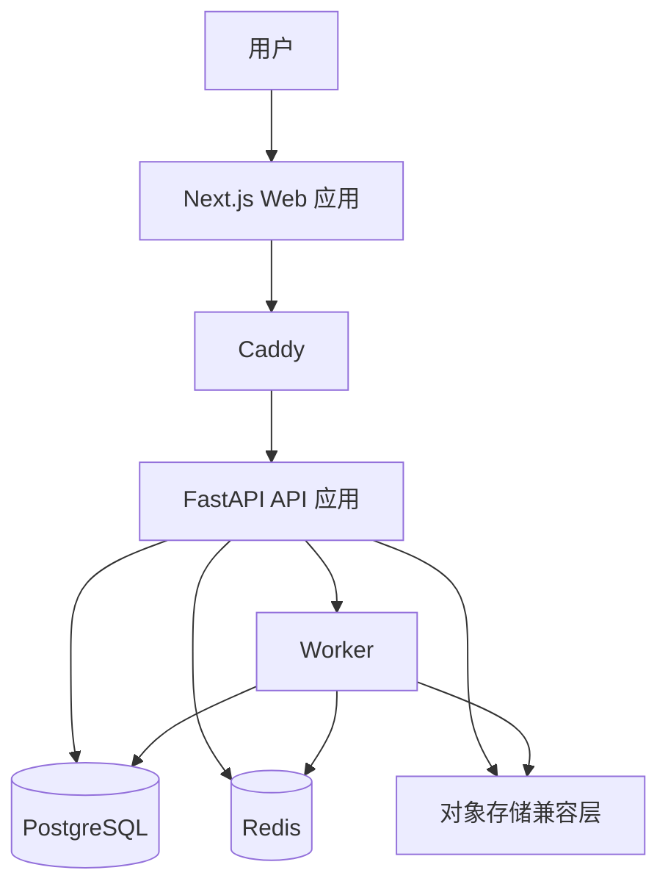
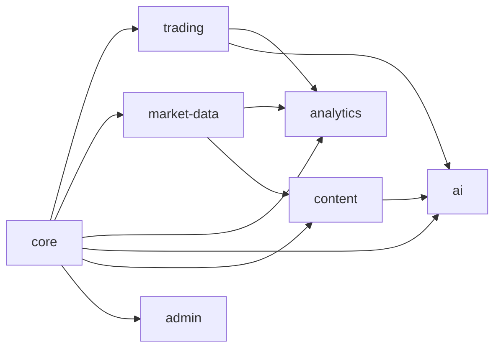
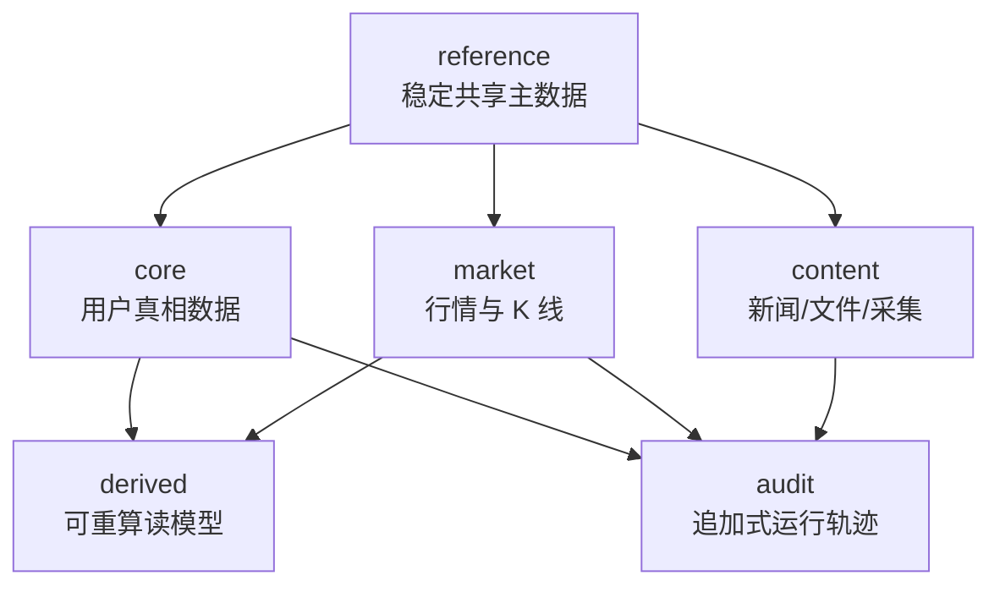

# Trading Noobs 平台底座设计

> 状态：已在 2026-04-06 的协作式设计讨论中确认。本文件是下一步 implementation planning 的架构基线。

## 目标

构建一个面向托管式 B2C 交易日志产品的平台底座，使其能够支撑正式上线，适配单台 ARM VPS 上约 1000 用户量级的运行需求，并为未来的 App 客户端、更丰富的图表系统、市场数据中间层，以及后续 AI 商业化能力预留清晰的升级路径。

## 设计摘要

推荐的整体形态是：在单台 VPS 上通过 `Docker Compose` 部署一个 `模块优先的单体系统（module-first monolith）`，以 `PostgreSQL` 作为唯一系统事实源，以 `Redis` 负责缓存与异步协调，并引入独立的 `worker` 进程处理重任务。同时，图表和分析数据应采用 `schema-first` 的契约方式，避免未来 Web 和 App 客户端被某一个具体 UI 图表库绑死。

这个系统应优先优化以下目标：

- 核心交易记录的数据正确性
- 可恢复性与迁移纪律
- 清晰的领域边界，避免继续把职责堆进大型 router / service
- 当前 Web 端的良好使用体验，以及未来 App 端的平滑复用
- 对市场数据历史、内容采集与 AI 工作流的可控长期扩展

## 约束条件

### 产品约束

- 产品由项目方统一托管；用户当前只通过 Web 访问，后续再扩展到 App
- AI 是未来的商业化方向之一，但不是当前最优先的实现目标
- 新闻 / SEC / 文件类能力在首阶段定位为轻量的信息收集与展示模块，而不是重型研究平台

### 基础设施约束

- 首发阶段使用单台 VPS
- 机器规格为 ARM，4 CPU / 24 GB RAM
- 部署方式为 `Docker Compose`
- 当前假设的规模约为 1000 用户
- 行情更新目标为分钟级，而不是 tick 级
- AI 分析目标是对用户交易记录做批处理分析，而不是对标的做实时推理

### 数据约束

- 开发与生产统一使用 `PostgreSQL`
- 市场数据很重要，也允许长期保留，但它不是用户核心真相数据
- 市场数据与衍生数据必须被设计为可回填 / 可重算

## 推荐的运行时拓扑

## 推荐技术选型

| 领域 | 推荐方案 | 原因 |
|------|----------|------|
| Web 客户端 | `Next.js` | 延续当前投入，重点优化架构而不是重写前端 |
| 图表渲染 | `ECharts` | 表达能力和交互体验上限高于当前图表体系 |
| 后端 API | `FastAPI` | 适合做类型明确的模块化 API，也适合 Python 异步任务生态 |
| 主数据库 | `PostgreSQL` | 数据正确性、事务能力、索引能力和后续扩展能力都更强 |
| 数据库迁移 | `Alembic` | 必须替换当前临时式 schema 演进方式 |
| 缓存 / 协调 | `Redis` | 用于缓存、幂等辅助、队列状态、限流辅助 |
| 异步任务 | 基于 Redis 的独立 `worker` 进程 | 将 AI、行情回填、预聚合、内容采集等重任务移出请求链路 |
| 对象 / 文件存储 | 后续引入 S3 兼容层 | 为截图、报表导出、原始文件、内容工件做准备 |
| 图表契约 | 服务端输出 schema-first 图表协议 | 让 Web 和未来 App 能独立渲染 |
| 行情数据库演进 | `Timescale-ready`，而不是 `Timescale-first` | 提前保留迁移路径，但不在首发阶段过度复杂化 |

## 内部模块边界

系统整体仍然是一个可部署单元，但代码结构与数据边界必须按领域拆开。

### 模块职责

| 模块 | 职责 |
|------|------|
| `core` | config、auth、permissions、sessions、audit、jobs、observability |
| `trading` | accounts、positions、events、ledger、strategies、daily review、notes |
| `market-data` | provider abstraction、quote history、asset identity、refill jobs、coverage tracking |
| `analytics` | dashboard metrics、chart schemas、materialized read models、reporting views |
| `ai` | prompt registry、model providers、batch jobs、insight results |
| `content` | news/file ingestion、content metadata、extraction、summary、symbol linkage |
| `admin` | platform settings、user operations、maintenance、feature flags、health views |

## 数据库设计原则

数据库不应该继续作为一个“所有数据都混在一起的仓库”。它应当是一套单一 `PostgreSQL` 系统，但在逻辑上拆成六个明确的数据域，最好对应独立 schema，而不是都继续放在 `public` 下。

### 各域含义

| 数据域 | 含义 |
|--------|------|
| `core` | 面向用户的交易真相数据 |
| `reference` | 共享主数据与低频变化分类数据 |
| `market` | 长期保留的行情历史与快照，可从上游回填 |
| `derived` | 图表读模型、缓存、预聚合、可重算结果 |
| `audit` | 安全、后台、任务、变更与操作轨迹 |
| `content` | 新闻 / 文件 / SEC 内容的采集与展示层 |

### 关键规则

1. `core` 是真相层，其他域不能反向成为 `core` 的上游真相来源。
2. `market`、`derived`、`content` 可以长期保留大量数据，但它们的保留、回填、重建策略必须和 `core` 分开。
3. UI、AI、内容模块必须通过服务层 / 领域接口读取数据，不能把物理表结构直接写死在业务里。
4. 将来如果演进到时序增强能力，只允许影响 `market` 域，不能波及 `core`。

## 数据正确性规则

### 核心真相模型

核心交易数据应采用 `事件真相 + 聚合状态` 的设计方式：

- 更接近真相的记录：
  - `position_events`
  - `account_ledger_entries`
  - `audit` 记录
  - `job_executions`
- 当前态 / 聚合态记录：
  - `trading_positions`
  - 账户余额与净值
  - `portfolio_snapshots`
  - Dashboard / 图表衍生结果

### 必须落地的完整性规则

- 每张 `core` 表都必须有主键
- `core` 内部使用强外键
- 身份、幂等、唯一业务规则必须落库，不靠代码约定
- 价格、数量、金额全部使用定点数值类型
- 枚举值、状态流转、方向、类型必须受限
- 核心实体优先软删除或状态禁用，不直接硬删除
- 导入、异步任务、文件采集、重试写入都必须支持幂等

## 可恢复性规则

### 迁移纪律

- 生产 schema 变更必须走 `Alembic`
- `create_all()` 不能作为线上迁移方案
- 复杂迁移必须采用分阶段策略：
  - 先加新结构
  - 再回填
  - 再切换读写路径
  - 最后移除旧结构

### 备份与恢复纪律

- 每日逻辑备份
- 卷级快照策略
- 强烈建议至少保留一份异地备份
- 强烈建议未来支持基于 WAL / PITR 的恢复能力
- 恢复演练必须成为常规运维动作的一部分

### 恢复优先级

| 优先级 | 数据域 |
|--------|--------|
| `P0` | `core` |
| `P1` | `reference` |
| `P1` | `audit` |
| `P2` | `market` |
| `P2` | `content` |
| `P3` | `derived` |

这体现了本产品最核心的一条原则：用户的交易真相必须保住；即使行情和衍生结果需要后补，也不能丢真相。

## 命名模型优化

当前命名需要做收敛，使表之间的逻辑关系更直观。

### 推荐的核心重命名

| 当前命名 | 推荐命名 |
|---------|----------|
| `Position` | `TradingPosition` |
| `TradeBatch` | `PositionEvent` |
| `Transaction` | `AccountLedgerEntry` |
| `AssetMetadata` | `AssetMaster` |
| `DailySnapshot` | `PortfolioSnapshot` |
| `Strategy` | `TradingStrategy` |
| `UserSettings` | `UserPreference` |
| `SystemSetting` | `PlatformSetting` |
| `JournalEntry` | `DailyNote` |
| `DailySummary` | `TradingDayReview` |

### 这些命名为什么更清晰

- `PositionEvent` 比 `TradeBatch` 更准确，因为后者很像导入批次或批处理任务
- `AccountLedgerEntry` 能清楚区分“账户资金流水”和“持仓变化事件”
- `AssetMaster` 更贴近“统一资产主数据”，而不只是零散 metadata
- `PortfolioSnapshot` 说明它记录的是“组合快照”，而不只是“按日的某个表”

## 按数据域划分的表策略

### `core`

建议保留或演进为：

- `users`
- `user_preferences`
- `trading_accounts`
- `trading_positions`
- `position_events`
- `account_ledger_entries`
- `trading_strategies`
- `strategy_checklists`
- `trading_day_reviews`
- `daily_notes`

### `reference`

建议保留或演进为：

- `asset_master`
- `asset_aliases`
- `exchanges`
- `currencies`
- `asset_classifications`
- `market_calendars`

### `market`

建议新增或演进为：

- `market_symbols`
- `quote_snapshots`
- `price_bars_1m`
- `price_bars_1d`
- `market_fetch_jobs`
- `market_data_coverage`

### `derived`

建议新增或演进为：

- `portfolio_snapshots`
- `dashboard_cache`
- `chart_materializations`
- `analysis_results`
- `insight_results`

### `audit`

建议新增或演进为：

- `audit_logs`
- `admin_actions`
- `job_executions`
- `idempotency_keys`
- `auth_events`

### `content`

建议新增或演进为：

- `content_sources`
- `content_documents`
- `content_document_assets`
- `content_ingestion_jobs`
- `content_extractions`
- `content_summaries`

## 规范化与反规范化边界

| 数据域 | 建议倾向 |
|--------|----------|
| `core` | 强规范化 |
| `reference` | 强规范化 |
| `market` | 以时序查询友好为目标的轻度反规范化 |
| `derived` | 主动反规范化，但必须可重算 |
| `content` | 关系结构规范化 + 抽取结果半结构化 |
| `audit` | 追加写为主，记录尽量不可变 |

### JSON 使用原则

建议把 JSON 主要用在：

- `derived`
- `content`
- 部分 `audit` 载荷

不建议继续扩大 JSON 在 `core` 中的使用范围，除非该数据确实不会被业务查询、校验、统计或审计。

## 用户与认证底座

当前只有简单 `users` 表的做法，不足以支撑后续想要补齐的认证能力。

### 用户 / 认证模型方向

保留 `users` 作为用户主体表，并新增：

- `user_credentials`
- `user_sessions`
- `user_identities`
- `auth_tokens`

### 用户标识建议

采用双标识策略：

- `users.id` 作为内部 `bigint`
- `users.public_id` 作为对外 `uuid`

这样既能保持内部 join 与索引效率，也能为外部接口、App 和分享链接提供更安全的公开标识。

### 近期就应补上的字段

- `public_id`
- `status`
- `email_normalized`
- `last_login_at`

### 注册与认证策略框架

建议平台支持可配置的注册模式：

- `open`
- `invite_only`
- `approval_required`
- `closed`

并支持类似以下策略输入：

- 允许注册的邮箱域名
- 是否要求邮箱验证
- 邀请额度

这样未来要调整注册限制时，不需要重新设计认证数据模型。

## 横切平台能力

即使只是 1000 用户量级，这些能力也应该作为平台底座的一部分提前补上。

### 身份与安全

- 会话管理
- 密码重置
- 邮箱验证
- 注册限制
- 未来 SSO / 第三方登录支持

### 配置与凭据治理

- 平台配置与密钥分离
- 敏感信息掩码显示与加密存储
- 配置变更审计轨迹
- provider 启停控制

### Job、重试与幂等

- AI 任务
- 行情回填
- 内容采集
- 预聚合任务
- 重试跟踪
- 失败载荷记录
- 敏感写操作的幂等键

### 审计与数据血缘

- 谁改了平台配置
- 哪个 job 生成了某条 insight
- 哪个 provider 填充了 market / content 数据
- 为什么某次用户 / 会话 / 动作失败或被阻断

### 备份、恢复与迁移纪律

- 定时备份
- 恢复演练
- 严格迁移流程

### 可观测性

- 结构化日志
- 请求日志
- 任务日志
- 健康检查
- 错误可见性
- 慢查询可见性

## App 兼容性原则

只要平台把 API 与图表契约当成产品级复用接口，而不是仅服务 Web 页面，这套架构就对未来 iOS / Android 是友好的。

### 可被未来 App 复用的部分

- 身份与认证模型
- 交易域 API
- 市场数据 API
- 分析与图表 schema
- AI 任务与结果 schema

### 不能直接复用的部分

- 当前的 Next.js 页面实现
- 直接绑定具体图表库的前端渲染逻辑

### 必须坚持的原则

构建 `schema-first` 的图表契约，以及 `domain-first` 的业务 API；Web 和 App 各自渲染，而不是共享页面实现。

## 内容模块定位

规划中的新闻 / SEC / 文件功能，首阶段应定位为主系统内的轻量模块，而不是独立产品。

推荐定位如下：

- 有独立的领域边界
- 当前先与主系统同部署
- 当前先与主系统共用同一个数据库实例，但独立 schema / 表族
- 若未来成长为研究工作台，再演进成独立子系统

## 演进路径

### Phase 1：基础底座重置

- 正式定义 schema 边界
- 接入 `Alembic`
- 重命名 / 演进核心实体
- 引入 Redis + worker
- 拆出配置、任务、审计、认证支撑表

### Phase 2：市场数据与分析结构化

- 建立市场数据中间层边界
- 将图表逻辑下沉到 analytics schema 与图表契约
- 引入长期保留的行情历史表

### Phase 3：内容模块

- 增加轻量信息采集与展示域
- 保持其与交易真相数据解耦

### Phase 4：AI 强化

- Prompt registry
- provider abstraction
- 结果与版本跟踪
- 为未来计量能力预留挂点

### Phase 5：未来可选拆分

- `market` 域可进一步演进到类 Timescale 的时序增强能力
- `content` 域可进一步演进成独立子系统
- App 客户端可直接复用稳定的 API 与图表契约

## 本设计已确认的关键决策

- 选择模块优先的单体，而不是过早微服务化
- 选择 `PostgreSQL` 作为开发与生产的唯一数据库
- 选择 `ECharts` 以获得更强的图表表达能力与 Web 体验
- 市场数据长期保留，但视为可回填数据，而不是用户真相数据
- 新闻 / 内容 / SEC 功能先作为内部模块，不单独做产品
- 提前把市场数据域设计成 `Timescale-ready`
- `core` 与 `reference` 倾向强规范化；`derived` 允许按读模型主动反规范化
- 用户 / 认证骨架现在就重构到位，即使不是所有认证功能都立刻实现

## 待 implementation planning 再定的事项

以下问题留到 implementation planning 阶段明确，不阻塞当前设计：

- 异步任务库的具体选型
- 密钥加密的具体实现方案
- 原始文件内容未来落对象存储的具体技术选型
- 当前 ORM 模型与表重命名的具体 rollout 顺序
- analytics / chart schema 的具体格式与版本策略
