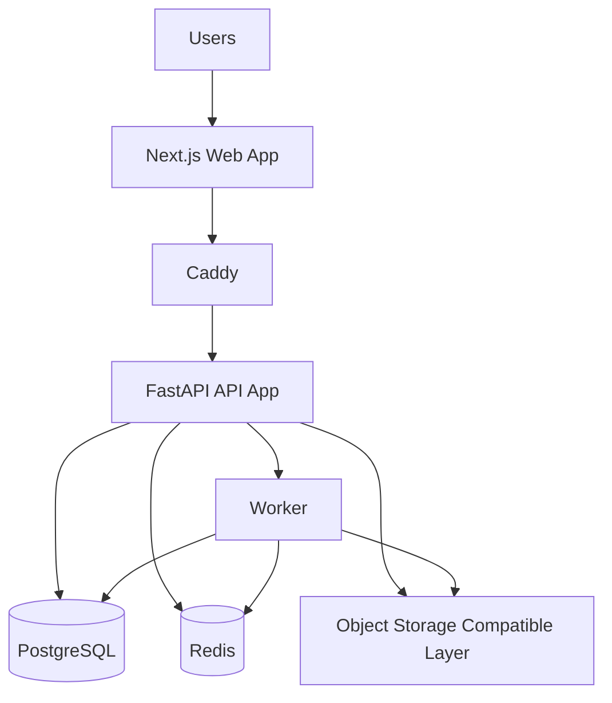
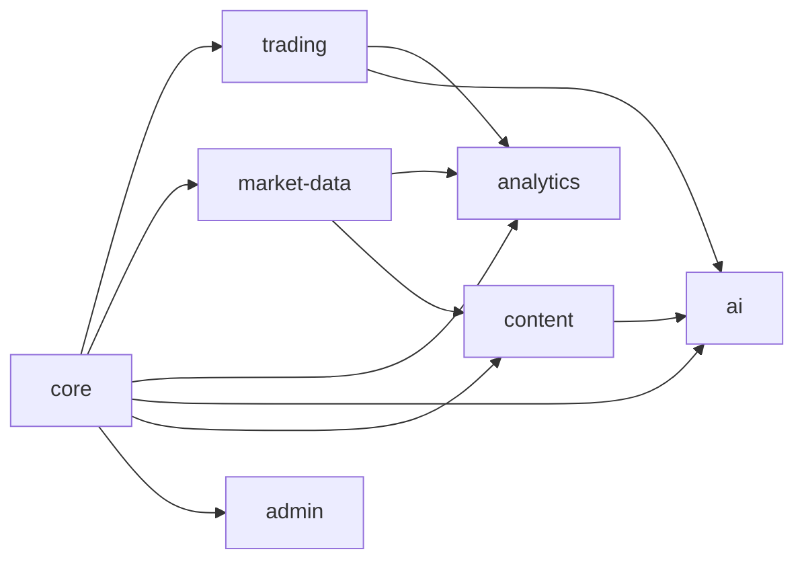
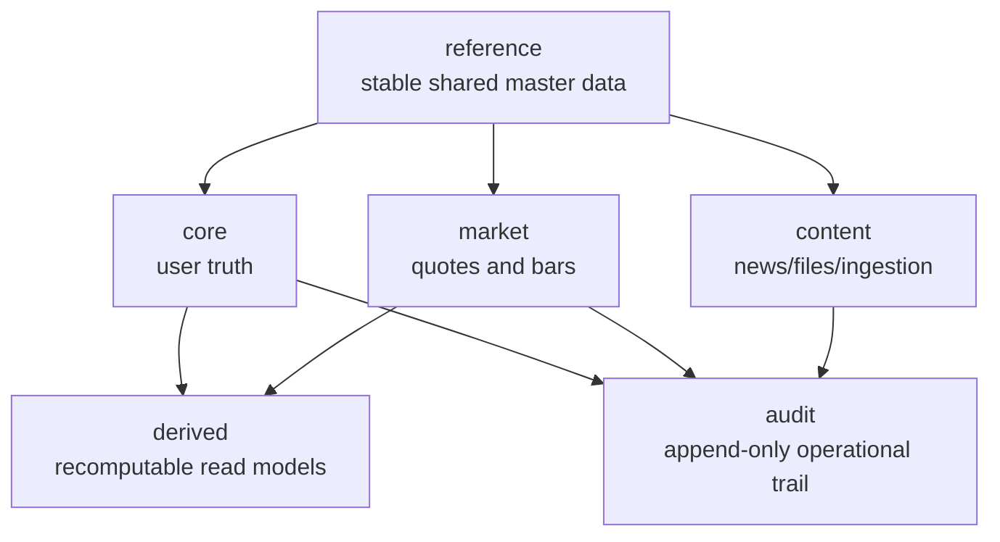

# Trading Noobs Platform Foundation Design

> Status: Approved in collaborative design discussion on 2026-04-06. This document is the architecture baseline for the next implementation-planning step.

## Goal

Build a hosted B2C trading journal platform foundation that is stable enough for production launch, supports roughly 1000 users on a single ARM VPS, and leaves clean upgrade paths for future App clients, a richer charting system, a market-data middle layer, and later AI monetization.

## Design Summary

The recommended shape is a `module-first monolith` deployed on one VPS with `Docker Compose`, backed by `PostgreSQL` as the single system of record, `Redis` for cache and async coordination, a separate `worker` process for heavy jobs, and a schema-first charting/data contract that keeps future Web and App clients decoupled from specific UI libraries.

The system should optimize for:

- Data correctness in core trading records
- Recoverability and migration discipline
- Explicit domain boundaries instead of large mixed routers/services
- Good UX on the Web now and clean App reuse later
- Controlled long-term expansion into market-data history, content ingestion, and AI workflows

## Constraints

### Product constraints

- Hosted by the product owner; users access only Web now, App later
- AI is a future monetization point, but not the first implementation priority
- Content/news/SEC features are initially a light information collection and display module, not a heavy research platform

### Infrastructure constraints

- Single VPS for launch
- ARM, 4 CPU / 24 GB RAM
- `Docker Compose` deployment
- Current assumed scale: around 1000 users
- Market data freshness target: minute-level, not tick-level
- AI analysis target: batch analysis over user trade records, not real-time asset inference

### Data constraints

- `PostgreSQL` is the only supported database for development and production
- Market data is important and can be retained long term, but is not core user truth
- Market data and derived data must be designed to be refillable/recomputable

## Recommended Runtime Topology

## Recommended Technology Selections

| Area | Recommendation | Why |
|------|----------------|-----|
| Web client | `Next.js` | Keep current investment and improve architecture, not rewrite the client |
| Chart rendering | `ECharts` | Better expressiveness and UX headroom than the current chart setup |
| Backend API | `FastAPI` | Good fit for typed modular API and worker-friendly Python ecosystem |
| Main DB | `PostgreSQL` | Strong correctness, transactions, indexing, and future extension options |
| DB migration | `Alembic` | Required to replace ad hoc schema evolution |
| Cache / coordination | `Redis` | Cache, idempotency support, queue state, rate-limit helpers |
| Async jobs | `Worker` process backed by Redis | Keep heavy AI, market refill, aggregation, and ingestion work out of request path |
| Object/file storage | S3-compatible layer later | Required for future screenshots, report outputs, raw files, and content artifacts |
| Chart contract | Schema-first server output | Lets Web and future App render charts independently |
| Market DB evolution | `Timescale-ready`, not `Timescale-first` | Keep migration path open without overcomplicating launch |

## Internal Module Boundaries

The system remains one deployable application, but code and data boundaries should be split by domain.

### Module responsibilities

| Module | Responsibility |
|--------|----------------|
| `core` | config, auth, permissions, sessions, audit, jobs, observability |
| `trading` | accounts, positions, events, ledger, strategies, daily review, notes |
| `market-data` | providers, quote history, asset identity, refill jobs, coverage tracking |
| `analytics` | dashboard metrics, chart schemas, materialized read models, reporting views |
| `ai` | prompt registry, model providers, batch jobs, insight results |
| `content` | news/file ingestion, content metadata, extraction, summary, symbol linkage |
| `admin` | platform settings, user operations, maintenance, feature flags, health views |

## Database Design Principles

The database should not be a single mixed warehouse. It should be one `PostgreSQL` system split into six logical domains, ideally as separate schemas.

### Domain meanings

| Domain | Meaning |
|--------|---------|
| `core` | Canonical user-facing trading truth |
| `reference` | Shared master data and slow-moving classifications |
| `market` | Retained market history and snapshots, refillable from upstream |
| `derived` | Recomputable chart/read-model/cache outputs |
| `audit` | Security, admin, job, and change trail |
| `content` | Information ingestion and display layer for news/files/SEC content |

### Critical rules

1. `core` is truth; other domains must not become upstream truth for `core`.
2. `market`, `derived`, and `content` can retain large volumes, but their rebuild/retention policies must stay separate from `core`.
3. UI features, AI, and content views must read through service/domain interfaces, not hardcode physical table assumptions.
4. Future time-series evolution must affect only the `market` domain, not `core`.

## Data Correctness Rules

### Core truth model

Core trading data should follow an `event truth + aggregate state` design:

- Truth-like records:
  - position events
  - account ledger entries
  - audit records
  - job execution records
- Aggregate/current state records:
  - trading positions
  - account balances
  - portfolio snapshots
  - derived dashboard/chart results

### Required integrity rules

- Primary keys on every core table
- Strong foreign keys inside `core`
- Explicit unique constraints for identity and idempotency
- Decimal/fixed numeric types for prices, quantities, and monetary values
- Restricted enum/state transitions
- Soft-delete or status-based disable for critical entities instead of hard delete
- Idempotent writes for imports, jobs, file ingestion, and retries

## Recoverability Rules

### Migration discipline

- Production schema changes must go through `Alembic`
- `create_all()` is not acceptable as an online migration strategy
- Complex migrations must use staged rollout:
  - add new structure
  - backfill
  - switch reads/writes
  - remove deprecated structure later

### Backup and restore discipline

- Daily logical backups
- Volume-level snapshot strategy
- Strong recommendation: keep at least one backup copy off-box
- Strong recommendation: prepare for WAL/PITR-class recovery later
- Recovery drills must be part of normal operating practice

### Recovery priority

| Priority | Domain |
|----------|--------|
| `P0` | `core` |
| `P1` | `reference` |
| `P1` | `audit` |
| `P2` | `market` |
| `P2` | `content` |
| `P3` | `derived` |

This reflects the key product rule: user trade truth must survive even if market or derived data must later be rebuilt.

## Naming Model Improvements

The current naming should be adjusted to make relationships explicit.

### Recommended primary renames

| Current | Recommended |
|---------|-------------|
| `Position` | `TradingPosition` |
| `TradeBatch` | `PositionEvent` |
| `Transaction` | `AccountLedgerEntry` |
| `AssetMetadata` | `AssetMaster` |
| `DailySnapshot` | `PortfolioSnapshot` |
| `Strategy` | `TradingStrategy` |
| `UserSettings` | `UserPreference` |
| `SystemSetting` | `PlatformSetting` |
| `JournalEntry` | `DailyNote` |
| `DailySummary` | `TradingDayReview` |

### Why these matter

- `PositionEvent` is clearer than `TradeBatch`, which sounds like import/batch processing
- `AccountLedgerEntry` distinguishes account cash movement from position events
- `AssetMaster` makes it clear this is shared asset identity data, not incidental metadata
- `PortfolioSnapshot` clarifies the tracked subject better than a purely frequency-based name

## Recommended Table Strategy by Domain

### `core`

Keep or evolve into:

- `users`
- `user_preferences`
- `trading_accounts`
- `trading_positions`
- `position_events`
- `account_ledger_entries`
- `trading_strategies`
- `strategy_checklists`
- `trading_day_reviews`
- `daily_notes`

### `reference`

Keep or evolve into:

- `asset_master`
- `asset_aliases`
- `exchanges`
- `currencies`
- `asset_classifications`
- `market_calendars`

### `market`

Add/evolve into:

- `market_symbols`
- `quote_snapshots`
- `price_bars_1m`
- `price_bars_1d`
- `market_fetch_jobs`
- `market_data_coverage`

### `derived`

Add/evolve into:

- `portfolio_snapshots`
- `dashboard_cache`
- `chart_materializations`
- `analysis_results`
- `insight_results`

### `audit`

Add/evolve into:

- `audit_logs`
- `admin_actions`
- `job_executions`
- `idempotency_keys`
- `auth_events`

### `content`

Add/evolve into:

- `content_sources`
- `content_documents`
- `content_document_assets`
- `content_ingestion_jobs`
- `content_extractions`
- `content_summaries`

## Normalization vs Denormalization Rules

| Domain | Bias |
|--------|------|
| `core` | Strong normalization |
| `reference` | Strong normalization |
| `market` | Mild denormalization for time-range queries |
| `derived` | Intentional denormalization, but always recomputable |
| `content` | Mixed: normalized relationships plus semi-structured extraction payloads |
| `audit` | Append-oriented, mostly immutable records |

### JSON usage guidance

Prefer JSON mainly in:

- `derived`
- `content`
- selected `audit` payloads

Avoid growing JSON usage inside `core` unless data is truly not operationally queried, validated, or audited.

## User and Authentication Foundation

The current simple `users` approach is not enough for the desired future feature set.

### User/auth model direction

Keep `users` as the user subject table, then add:

- `user_credentials`
- `user_sessions`
- `user_identities`
- `auth_tokens`

### User identity recommendations

Use dual identifiers:

- `users.id` as internal `bigint`
- `users.public_id` as external `uuid`

This allows efficient joins internally and safer public/client-facing identifiers externally.

### Minimal fields to add soon

- `public_id`
- `status`
- `email_normalized`
- `last_login_at`

### Registration and auth policy framework

Plan for platform-configurable registration modes:

- `open`
- `invite_only`
- `approval_required`
- `closed`

And policy inputs such as:

- allowed email domains
- email verification requirement
- invite quota

This lets registration restrictions evolve without redesigning the auth data model.

## Cross-Cutting Platform Capabilities

These are required even at the 1000-user stage.

### Identity and security

- sessions
- password reset
- email verification
- registration restrictions
- future SSO/provider login support

### Credential/config governance

- platform settings separated from credentials
- masked and encrypted secrets
- audit trail for config changes
- provider enable/disable controls

### Jobs and idempotency

- async jobs for AI, market refill, content ingestion, pre-aggregation
- retry tracking
- failure payload capture
- idempotency keys for sensitive writes

### Audit and provenance

- who changed platform settings
- which job generated an insight
- which provider populated market/content data
- why a user/session/action failed or was blocked

### Backup/restore/migration discipline

- scheduled backups
- restore drills
- strict migration workflow

### Observability

- structured logs
- request logs
- job logs
- health endpoints
- error visibility
- slow query awareness

## App Compatibility Guidance

This architecture is App-compatible if the platform treats APIs and chart contracts as reusable product interfaces rather than Web-only implementation details.

### Reusable for future iOS/Android

- auth and user model
- trading domain APIs
- market-data APIs
- analytics/chart schemas
- AI job/result schemas

### Not directly reusable

- current Next.js page implementations
- direct chart-library-specific client rendering

### Required principle

Build `schema-first chart contracts` and `domain-first APIs`, then let Web and future App render them separately.

## Content Module Positioning

The planned news/SEC/file feature should start as a light module inside the main system, not as a separate product.

Recommended stance:

- independent domain boundary
- same deployment for now
- same database instance, separate schema/table family
- future path to independent subsystem if it grows into a research workspace

## Evolution Path

### Phase 1: Foundation reset

- Formalize schema boundaries
- Adopt `Alembic`
- Rename/evolve core entities
- Add Redis + worker
- Separate config, jobs, audit, and auth support tables

### Phase 2: Market-data and analytics structure

- Build market-data middle layer boundaries
- Move chart logic to analytics schemas and chart contracts
- Introduce retained market history tables

### Phase 3: Content module

- Add light information ingestion/display domain
- Keep it separate from trading truth

### Phase 4: AI hardening

- Prompt registry
- provider abstraction
- result/version tracking
- future metering hooks

### Phase 5: Optional future splits

- `market` domain can move toward Timescale-style time-series extension
- `content` can become an independent subsystem
- App clients can reuse stable APIs and chart contracts

## Decisions Captured in This Design

- Choose module-first monolith over early microservices
- Choose `PostgreSQL` as the only DB for dev and prod
- Choose `ECharts` for richer Web chart UX
- Keep market data long-term, but treat it as refillable rather than user truth
- Keep content/news/SEC as an internal module first, not a separate product
- Prepare market-data domain to be `Timescale-ready`
- Normalize `core` and `reference`; denormalize `derived` by design
- Redesign user/auth tables now at the framework level, even if all auth features are not implemented immediately

## Open Implementation Questions

These are deferred to implementation planning, not blockers for this design:

- Exact async job library choice
- Exact secret encryption strategy
- Exact storage choice for future raw content files
- Exact rollout order for renaming current ORM models and tables
- Exact analytics/chart schema format and versioning rules
