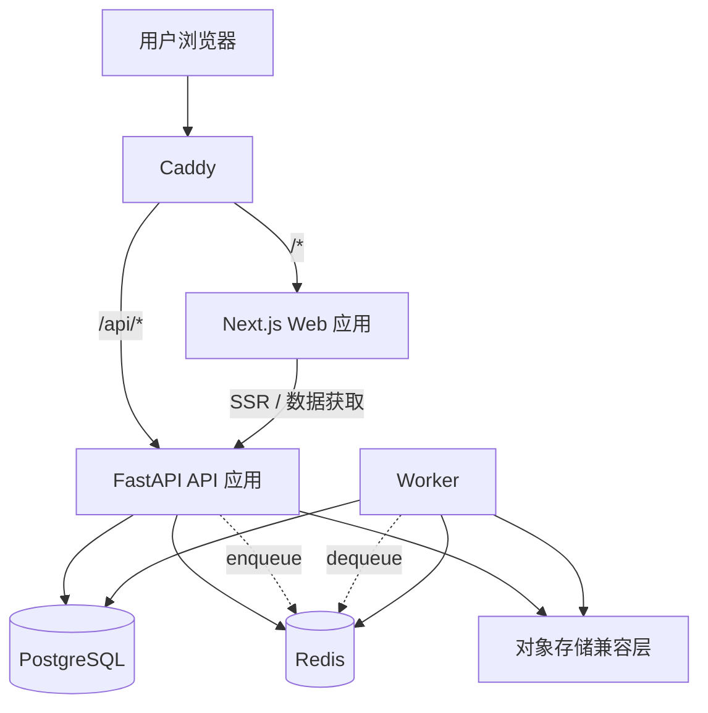
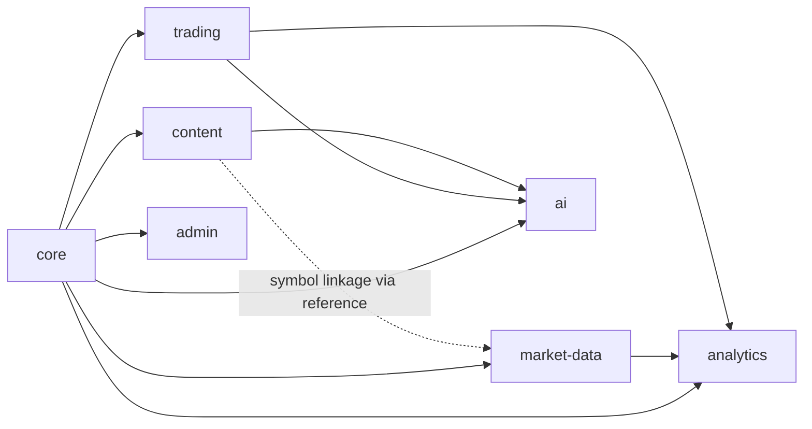
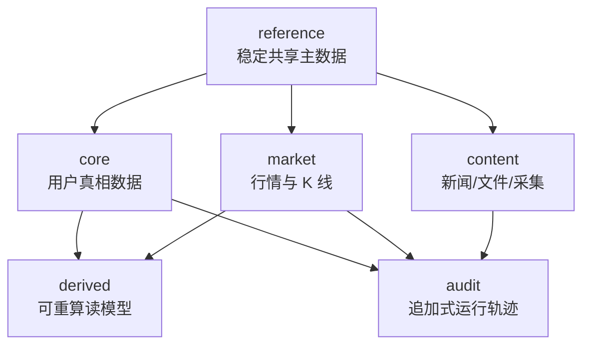

# Trading Noobs 平台底座设计

> 状态：已在 2026-04-06 的协作式设计讨论中确认。本文件是下一步 implementation planning 的架构基线。

## 目标

构建一个面向托管式 B2C 交易日志产品的平台底座，使其能够支撑正式上线，适配单台 ARM VPS 上约 1000 用户量级的运行需求，并为未来的 App 客户端、更丰富的图表系统、市场数据中间层，以及后续 AI 商业化能力预留清晰的升级路径。

## 设计摘要

推荐的整体形态是：在单台 VPS 上通过 `Docker Compose` 部署一个 `模块优先的单体系统（module-first monolith）`，以 `PostgreSQL` 作为唯一系统事实源，以 `Redis` 负责缓存与异步协调，并引入独立的 `worker` 进程处理重任务。同时，图表和分析数据应采用 `schema-first` 的契约方式，避免未来 Web 和 App 客户端被某一个具体 UI 图表库绑死。

这个系统应优先优化以下目标：

- 核心交易记录的数据正确性
- 可恢复性与迁移纪律
- 清晰的领域边界，避免继续把职责堆进大型 router / service
- 当前 Web 端的良好使用体验，以及未来 App 端的平滑复用
- 对市场数据历史、内容采集与 AI 工作流的可控长期扩展

## 约束条件

### 产品约束

- 产品由项目方统一托管；用户当前只通过 Web 访问，后续再扩展到 App
- AI 是未来的商业化方向之一，但不是当前最优先的实现目标
- 新闻 / SEC / 文件类能力在首阶段定位为轻量的信息收集与展示模块，而不是重型研究平台

### 基础设施约束

- 首发阶段使用单台 VPS
- 机器规格为 ARM，4 CPU / 24 GB RAM
- 部署方式为 `Docker Compose`
- 当前假设的规模约为 1000 用户
- 行情更新目标为分钟级，而不是 tick 级
- AI 分析目标是对用户交易记录做批处理分析，而不是对标的做实时推理

### 数据约束

- 开发与生产统一使用 `PostgreSQL`
- 市场数据很重要，也允许长期保留，但它不是用户核心真相数据
- 市场数据与衍生数据必须被设计为可回填 / 可重算

## 推荐的运行时拓扑

## 推荐技术选型

| 领域 | 推荐方案 | 原因 |
|------|----------|------|
| Web 客户端 | `Next.js` | 延续当前投入，重点优化架构而不是重写前端 |
| 图表渲染 | `ECharts` | 表达能力和交互体验上限高于当前图表体系 |
| 后端 API | `FastAPI` | 适合做类型明确的模块化 API，也适合 Python 异步任务生态 |
| 主数据库 | `PostgreSQL` | 数据正确性、事务能力、索引能力和后续扩展能力都更强 |
| 数据库迁移 | `Alembic` | 必须替换当前临时式 schema 演进方式 |
| 缓存 / 协调 | `Redis` | 用于缓存、幂等辅助、队列状态、限流辅助 |
| 异步任务 | 基于 Redis 的独立 `worker` 进程 | 将 AI、行情回填、预聚合、内容采集等重任务移出请求链路 |
| 对象 / 文件存储 | 后续引入 S3 兼容层 | 为截图、报表导出、原始文件、内容工件做准备 |
| 图表契约 | 服务端输出 schema-first 图表协议 | 让 Web 和未来 App 能独立渲染 |
| 行情数据库演进 | `Timescale-ready`，而不是 `Timescale-first` | 提前保留迁移路径，但不在首发阶段过度复杂化 |

## 内部模块边界

系统整体仍然是一个可部署单元，但代码结构与数据边界必须按领域拆开。

### 模块职责

| 模块 | 职责 |
|------|------|
| `core` | config、auth、permissions、sessions、audit、jobs、observability |
| `trading` | accounts、positions、events、ledger、strategies、daily review、notes |
| `market-data` | provider abstraction、quote history、asset identity、refill jobs、coverage tracking |
| `analytics` | dashboard metrics、chart schemas、materialized read models、reporting views |
| `ai` | prompt registry、model providers、batch jobs、insight results |
| `content` | news/file ingestion、content metadata、extraction、summary、symbol linkage |
| `admin` | platform settings、user operations、maintenance、feature flags、health views |

## 数据库设计原则

数据库不应该继续作为一个“所有数据都混在一起的仓库”。它应当是一套单一 `PostgreSQL` 系统，但在逻辑上拆成六个明确的数据域，最好对应独立 schema，而不是都继续放在 `public` 下。

### 各域含义

| 数据域 | 含义 |
|--------|------|
| `core` | 面向用户的交易真相数据 |
| `reference` | 共享主数据与低频变化分类数据 |
| `market` | 长期保留的行情历史与快照，可从上游回填 |
| `derived` | 图表读模型、缓存、预聚合、可重算结果 |
| `audit` | 安全、后台、任务、变更与操作轨迹 |
| `content` | 新闻 / 文件 / SEC 内容的采集与展示层 |

### 关键规则

1. `core` 是真相层，其他域不能反向成为 `core` 的上游真相来源。
2. `market`、`derived`、`content` 可以长期保留大量数据，但它们的保留、回填、重建策略必须和 `core` 分开。
3. UI、AI、内容模块必须通过服务层 / 领域接口读取数据，不能把物理表结构直接写死在业务里。
4. 将来如果演进到时序增强能力，只允许影响 `market` 域，不能波及 `core`。

## 数据正确性规则

### 核心真相模型

核心交易数据应采用 `事件真相 + 聚合状态` 的设计方式：

- 更接近真相的记录：
  - `position_events`
  - `account_ledger_entries`
  - `audit` 记录
  - `job_executions`
- 当前态 / 聚合态记录：
  - `trading_positions`
  - 账户余额与净值
  - `portfolio_snapshots`
  - Dashboard / 图表衍生结果

### 必须落地的完整性规则

- 每张 `core` 表都必须有主键
- `core` 内部使用强外键
- 身份、幂等、唯一业务规则必须落库，不靠代码约定
- 价格、数量、金额全部使用定点数值类型
- 枚举值、状态流转、方向、类型必须受限
- 核心实体优先软删除或状态禁用，不直接硬删除
- 导入、异步任务、文件采集、重试写入都必须支持幂等

## 可恢复性规则

### 迁移纪律

- 生产 schema 变更必须走 `Alembic`
- `create_all()` 不能作为线上迁移方案
- 多 schema 采用“单 `Alembic env` + 统一迁移链”方案
- `Alembic` 配置需支持 `include_schemas=True`
- 复杂迁移必须采用分阶段策略：
  - 先加新结构
  - 再回填
  - 再切换读写路径
  - 最后移除旧结构

### 备份与恢复纪律

- 每日逻辑备份
- 卷级快照策略
- 强烈建议至少保留一份异地备份
- 强烈建议未来支持基于 WAL / PITR 的恢复能力
- 恢复演练必须成为常规运维动作的一部分

### 恢复优先级

| 优先级 | 数据域 |
|--------|--------|
| `P0` | `core` |
| `P1` | `reference` |
| `P1` | `audit` |
| `P2` | `market` |
| `P2` | `content` |
| `P3` | `derived` |

这体现了本产品最核心的一条原则：用户的交易真相必须保住；即使行情和衍生结果需要后补，也不能丢真相。

## 命名模型优化

当前命名需要做收敛，使表之间的逻辑关系更直观。

### 推荐的核心重命名

| 当前命名 | 推荐命名 |
|---------|----------|
| `Position` | `TradingPosition` |
| `TradeBatch` | `PositionEvent` |
| `Transaction` | `AccountLedgerEntry` |
| `AssetMetadata` | `AssetMaster` |
| `DailySnapshot` | `PortfolioSnapshot` |
| `Strategy` | `TradingStrategy` |
| `UserSettings` | `UserPreference` |
| `SystemSetting` | `PlatformSetting` |
| `JournalEntry` | `DailyNote` |
| `DailySummary` | `TradingDayReview` |

### 这些命名为什么更清晰

- `PositionEvent` 比 `TradeBatch` 更准确，因为后者很像导入批次或批处理任务
- `AccountLedgerEntry` 能清楚区分“账户资金流水”和“持仓变化事件”
- `AssetMaster` 更贴近“统一资产主数据”，而不只是零散 metadata
- `PortfolioSnapshot` 说明它记录的是“组合快照”，而不只是“按日的某个表”

## 按数据域划分的表策略

### `core`

建议保留或演进为：

- `users`
- `user_preferences`
- `trading_accounts`
- `trading_positions`
- `position_events`
- `account_ledger_entries`
- `trading_strategies`
- `strategy_checklists`
- `trading_day_reviews`
- `daily_notes`

### `reference`

建议保留或演进为：

- `asset_master`
- `asset_aliases`
- `exchanges`
- `currencies`
- `asset_classifications`
- `market_calendars`

### `market`

建议新增或演进为：

- `market_symbols`
- `quote_snapshots`
- `price_bars_1m`
- `price_bars_1d`
- `market_fetch_jobs`
- `market_data_coverage`

### `derived`

建议新增或演进为：

- `portfolio_snapshots`
- `dashboard_cache`
- `chart_materializations`
- `analysis_results`
- `insight_results`

### `audit`

建议新增或演进为：

- `audit_logs`
- `admin_actions`
- `job_executions`
- `idempotency_keys`
- `auth_events`

### `content`

建议新增或演进为：

- `content_sources`
- `content_documents`
- `content_document_assets`
- `content_ingestion_jobs`
- `content_extractions`
- `content_summaries`

## 交易资产与工具模型

交易域不应只建模“资产”，还应显式建模“实际可交易工具”。

### 资产与工具分层

- `AssetMaster`
  - 基础资产主数据 / underlying
  - 例如：`NASDAQ:AAPL`、`HKEX:9988`、`BTCUSDT`
- `TradeInstrument`
  - 用户实际交易的工具实例
  - 例如：
    - `AAPL Spot`
    - `AAPL 2026-06-19 200C`
- `TradingPosition`
  - 用户在某个 `TradeInstrument` 上的一段完整持仓生命周期
- `PositionEvent`
  - 驱动某个 `TradingPosition` 变化的事件

### 关系建议

- `AssetMaster 1:N TradeInstrument`
- `TradeInstrument 1:N TradingPosition`
- `TradingPosition 1:N PositionEvent`

### `TradeInstrument` 的 V1 范围

V1 先支持：

- `SPOT`
- `EQUITY_OPTION`

其中：

- 现货资产由市场数据中台完整支持
- 股票期权只进入交易记录与上下文分析链路，不进入期权行情中台

### `TradingPosition` 的角色

`TradingPosition` 应被定义为：

> 某个用户在某个 `TradeInstrument` 上的一段完整持仓生命周期聚合

关键建议：

- 一次完整开仓到平仓周期对应一条 `TradingPosition`
- `TradingPosition` 引用 `instrument_id`
- 增加：
  - `opening_event_id`
  - `closing_event_id`

### `PositionEvent` 的 V1 字段方向

建议至少包含：

- `position_id`
- `instrument_id`
- `account_id`
- `event_type`
- `event_time`
- `price`
- `quantity`
- `currency`
- `fee_amount`
- `fee_currency`
- `realized_pnl_gross`
- `realized_pnl_net`
- `input_source`
- `reason`
- `emotion`
- `confidence`
- `note`

关键规则：

- `fee_amount` 与 `price` 分开录入
- `fee_currency` 独立保留
- `fee_currency` 默认取 `TradingAccount.currency`，但允许覆盖

### 股票期权支持边界

V1 必须支持股票期权，但边界应明确：

- 支持：
  - 期权工具识别
  - 期权交易录入
  - 已实现盈亏
  - 基于 underlying 现价的内在价值 / 行权收益估算
  - underlying 上下文分析
- 暂不支持：
  - 期权实时报价
  - 期权历史 K 线
  - 期权 MAE / MFE

### 持仓列表默认展示层级

默认建议：

1. 按上市资产分组
2. 组内按账户分组
3. 账户内按交易工具展示

例如：

- `NASDAQ:AAPL`
  - `IBKR`
    - `AAPL Spot`
    - `AAPL 2026-06-19 200C`
  - `Futu`
    - `AAPL Spot`
    - `AAPL 2026-06-19 180P`

原则：

- 真相层不合并不同账户的仓位
- 展示层可以按上市资产聚合
- 不同上市资产默认不因同一公司主体而合并

## 市场数据中台设计

### V1 支持范围

市场数据中台 V1 先聚焦：

- 美股股票 / ETF
- A 股股票 / 场内 ETF
- 港股股票 / ETF
- 加密现货

V1 暂不覆盖：

- 场外基金
- 债券
- 期权行情
- 期货
- 外汇交易品种
- 重型宏观数据库

### V1 能力边界

采用“标准能力集”：

- symbol / instrument 识别
- 最新报价
- 历史日线
- 市场日历
- `AssetProfile`
- provider fallback
- 覆盖范围记录
- 回填任务
- 统一错误码
- 质量状态

### Provider 三层结构

建议拆成三层：

1. `Provider Adapter`
   - 调上游接口
   - 做字段映射
   - 统一错误
2. `Capability Registry`
   - 管理 provider 能力矩阵与覆盖范围
3. `Market Data Orchestrator`
   - 负责识别、选择、fallback、缓存、落库、回填与质量状态

### AssetMaster 懒加载

`AssetMaster` 采用懒加载：

- 用户第一次新增 / 导入 / 查询某个标的时才生成
- 不做一开始的大范围主数据预灌

### 新标的首次进入系统的默认行为

当用户首次引入一个受支持标的：

1. 做范围校验与 symbol 归一
2. 生成或补齐 `AssetMaster`
3. 拉取 `AssetProfile`
4. 拉取最新报价
5. 异步预热：
   - 默认日线 `6-12` 个月
6. 若后续存在开放仓位，则启动分钟数据采集

### 日线与分钟线策略

- `日线`
  - 长期保留
  - 作为基础 K 线主来源
- `分钟线`
  - 不做全量历史回填
  - 只对“存在开放仓位”的标的开始记录
  - 主要服务 MAE / MFE 与过程分析
  - 仓位关闭后停止继续采集

### `AssetProfile` 来源策略

采用：

- 规则 + 上游 provider 为主
- 缺失时使用 AI 补全

### 核心表建议

在 `market` 域补齐：

- `quote_snapshots`
- `price_bars_daily`
- `price_bars_intraday`
- `market_data_coverage`
- `market_fetch_jobs`
- `market_source_status`

### 统一错误模型

建议至少统一这些错误码：

- `unsupported_instrument`
- `provider_unavailable`
- `profile_missing`
- `coverage_not_ready`
- `quote_stale`

## 图表与分析架构

### 总体方向

图表采用：

- `ECharts` 作为 Web 渲染器
- `schema-first` 作为图表协议策略
- `analytics` 模块作为图表与指标的统一分析来源

原则：

> 图表不是页面组件问题，而是 analytics 域输出的数据产品。

### 三层结构

建议拆成：

1. `Analytics Read Model`
2. `Chart Schema Layer`
3. `Renderer Layer`

其中：

- analytics 负责业务聚合与分析
- chart schema 负责稳定输出协议
- renderer 负责转换成 `ECharts option`

### 建议的图表类型

V1 先规范这些类型：

- `candlestick`
- `timeseries`
- `sankey`
- `scatter`
- `distribution`
- `metric_table`
- `event_timeline`

### 统一 Chart Schema 外壳

每个图表 schema 至少有：

- `chart_id`
- `chart_type`
- `schema_version`
- `title`
- `subtitle`
- `description`
- `data_quality`
- `time_context`
- `filters`
- `payload`
- `empty_state`
- `meta`

关键原则：

- schema 带版本
- schema 带 `quality / coverage / empty_state`
- `ECharts` 不是业务协议本身，只是渲染器

### 图表注册机制

建议建立 chart registry，每个图注册：

- `chart_id`
- `chart_type`
- `domain`
- `entity_scope`
- `input_schema`
- `analytics_builder`
- `schema_builder`
- `renderer_key`
- `version`

新增图表时的标准流程：

1. 定义图表目标
2. 定义输入参数
3. 实现 analytics builder
4. 输出 chart schema
5. 注册 renderer
6. 注册到 chart registry

### Analytics 模块职责

`analytics` 应独立成模块，负责：

- 指标计算
- 图表读模型
- 聚合视图
- 结果缓存 / 物化

其内部建议再拆成：

- `read model queries`
- `metric / analysis builders`
- `presentation adapters`

### 实时计算与 `derived` 分工

- 实时算：
  - 单个 position / asset 的轻量结果
  - 用户刚操作后的即时反馈
- 落 `derived`：
  - Dashboard 汇总
  - 复杂 Sankey
  - 历史收益曲线
  - 大批量 MAE / MFE 分析
- 实时 + 缓存混合：
  - 常用资产图表
  - 账户详情聚合
  - Position 时间线

### 主题与 i18n 的受益点

图表架构分层后：

- 换主题主要改 renderer 和 theme adapter
- 不影响 analytics 逻辑与 schema
- 图表标题、空状态、质量提示也更容易走 i18n

## 配置中心、i18n 与账户配置

### 配置分层原则

建议明确拆成：

1. `environment config`
2. `platform settings`
3. `integration credentials`
4. `user preferences`

其中：

- 运行底座与密钥类配置优先留在环境变量
- 平台配置可入库，但必须审计
- 第三方凭据单独建模并加密存储
- 用户偏好只影响该用户体验

### 配置可见性分级

建议把配置再分成三类：

1. `后台可运营配置`
   - 高频会调
   - 会影响系统行为
   - 需要审计
   - 需要可视化管理
2. `平台初始化默认值`
   - 只用于初始用户体验
   - 很少修改
   - 不必放进管理员页面主界面
3. `环境 / 部署配置`
   - 只通过环境变量或部署系统管理
   - 不进入后台

例如：

- `默认显示币种`
- `默认涨跌色`

更适合作为“平台初始化默认值”，而不是后台日常运营配置项。

### 独立后台入口

用户设置与管理员后台必须解耦。

建议：

- 用户侧：
  - `/settings/account`
  - `/settings/security`
  - `/settings/trading-accounts`
  - `/settings/preferences`
  - `/settings/appearance`
  - `/settings/integrations`
- 管理员侧：
  - `/admin/platform`
  - `/admin/users`
  - `/admin/integrations`
- `/admin/jobs`
- `/admin/feature-flags`
- `/admin/market-data`
- `/admin/content`
- `/admin/ai`
- `/admin/ops`

### Feature Flag

建议独立表建模：

- `feature_flags`

适合控制：

- 新图表灰度
- 新 provider 启停
- 新模块上线
- 新资产类型支持

### i18n 范围

V1 按至少 `B` 级别设计：

- 界面文案
- 系统消息
- 配置与后台说明

建议原则：

- UI 文案全部 key 化
- 错误码与错误消息分离
- 图表标题 / 空状态 / 质量提示预留 i18n 支持
- AI 输出默认跟随当前用户 locale，不单独维护 `preferred_ai_output_language`
- V1 支持语言收敛为：
  - 简体中文
  - 繁体中文
  - 英文
- i18n 基础设施需预留未来扩展更多语言的能力

### 用户账户配置重构

建议拆成三类：

1. 用户账户与安全
2. 交易账户与券商连接
3. 个人偏好与显示设置

### 交易账户的 V1 定位

交易账户按“半自动账户”设计：

- 手工账户继续支持
- 自动化能力先重点实现 `IBKR`
- 其他券商先继续手工录入 / 导入

### 管理员配置矩阵

管理员后台优先暴露这些配置板块：

- 注册与账户策略
- 安全策略
- 市场数据 provider 管理
- IBKR 同步配置
- AI 模型与模板管理
- 内容源与抓取策略
- 任务系统配置
- 备份、健康状态与告警

不建议把所有“仅作初始化默认值”的配置也放进管理员主界面。

## IBKR 半自动同步架构

### 推荐路线

建议采用：

- `IBKR Web API + OAuth2` 作为主同步链路
- `Flex Web Service` 作为补账 / 对账链路

不建议把 `TWS / IB Gateway` 作为托管式 B2C 产品的主同步链路。

### V1 范围

先做到：

- 账户连接配置
- 拉账户列表
- 拉账户基础信息
- 拉持仓
- 拉近期成交
- 同步任务与错误状态记录

先不追求：

- 完整对账平台
- 复杂资金流水自动重建
- 重型保证金 / 风险系统

### 建议表

- `broker_connections`
- `external_accounts`
- `account_sync_profiles`
- `sync_runs`
- `external_trade_mappings`

### 同步模式

建议：

- `定时同步 + 支持手动补同步`

其中：

- bootstrap：首次接入时拉账户、持仓、近期成交
- incremental：定时拉持仓和近期成交
- reconcile：日级通过 Flex 做补账 / 校准

### 幂等规则

至少以以下键做幂等：

- `broker + external_account + exec_id`

### 与交易模型的关系

- 成交同步优先驱动 `PositionEvent`
- 持仓快照主要作为校验与修正依据
- 股票期权可同步成交与持仓，但不要求接入期权行情中台

## 统一任务系统

### 总方向

所有异步能力都应接入统一任务系统，而不是各模块各自维护后台逻辑。

### 建议统一承接的任务

- 市场数据回填与 profile 补全
- IBKR 同步
- 内容采集 / 解析
- AI 批处理
- analytics 刷新与图表物化

### 核心表

- `job_definitions`
- `job_runs`
- `job_run_events`
- `idempotency_keys`

### 任务分类

建议按概念分成：

- `interactive jobs`
- `scheduled jobs`
- `maintenance jobs`
- `pipeline jobs`

### 任务运行规则

- 不同任务类型有独立 retry policy
- 不同目标对象要有并发控制
- 所有重任务都要支持幂等
- 前端可查询任务状态

### 外部依赖熔断与降级

对于市场数据 provider、AI provider、IBKR API、内容抓取源，统一采用轻量熔断策略：

- 连续失败达到阈值后，短时间熔断
- 熔断期间优先返回缓存 / stale 数据，并标记 `data_quality=degraded`
- 熔断恢复后允许重新进入主备 provider 选择流程
- 熔断事件写入审计或 provider 健康记录

### 关键并发控制示例

- 同一 `asset_id + timeframe` 的回填任务不能并发
- 同一 `broker_connection` 的同步任务不能并发
- 同一 `content_source` 的抓取任务不能并发
- 同一用户同一分析范围的 AI 任务不能并发

## API 版本与安全基线

### API 版本策略

建议从 Phase 1 起统一采用：

- `/api/v1/...`

并明确：

- Web 与未来 App 共用版本化 API
- REST API、chart schema、AI 输出 schema 各自独立版本化
- 旧版本废弃必须保留过渡窗口

### 限流与滥用防护

V1 至少落地基础限流：

- 全局 API 按用户限流
- Auth 端点按 IP 限流
- 市场数据端点按用户限流
- AI 端点按用户与时间窗限流
- 导入端点单独限流

建议实现：

- FastAPI middleware
- Redis 计数器 / 滑动窗口

## AI 分析中台

### 总方向

AI 中台 V1 采用“分析工作流平台”形态，而不是简单工具箱或持续对话助手。

### 第一原则：用户数据强隔离

所有 AI 分析任务都必须：

- 以 `user_id` 为边界隔离
- 按分析范围做上下文控制
- 禁止跨用户复用私有分析结果缓存

### 建议分层

建议拆成：

1. `Provider Layer`
2. `Prompt Registry`
3. `Context Builder`
4. `Workflow Orchestrator`
5. `Result Store`
6. `Usage & Audit`

### Prompt 策略

Prompt 由平台统一维护，不对普通用户开放自定义。

建议规则：

- 所有 prompt 模板都由平台管理
- 用户不直接编辑 prompt
- 用户最多提供“受限分析上下文”
- prompt 必须版本化
- 输出 schema 必须版本化

### 管理员可视化模板管理

虽然普通用户不能定义 prompt，但管理员应可在后台可视化维护：

- 模板正文
- 变量定义
- 变量来源
- 输出 schema
- 启用状态
- 版本发布与回滚
- 预览与测试运行
- 审计记录

建议在后台作为：

- `/admin/ai/templates`
- `/admin/ai/providers`
- `/admin/ai/runs`

### 建议表

- `ai_providers`
- `prompt_templates`
- `prompt_template_versions`
- `insight_runs`
- `insight_artifacts`
- `ai_usage_records`
- `ai_cache_entries`

### V1 适合的工作流

建议先支持：

- `weekly_insight_report`
- `journal_digest`
- `position_review`
- `strategy_health`
- `losing_streak_analysis`
- `emotion_pnl_analysis`
- `checklist_effect_analysis`

### 缓存策略

缓存键至少应包含：

- `user_id`
- `analysis_type`
- `scope_type`
- `scope_id`
- `input_hash`
- `prompt_version`
- `model_key`

### 语言策略

AI 输出语言默认跟随用户当前 locale，不再单独维护 AI 语言偏好字段。

## 规范化与反规范化边界

| 数据域 | 建议倾向 |
|--------|----------|
| `core` | 强规范化 |
| `reference` | 强规范化 |
| `market` | 以时序查询友好为目标的轻度反规范化 |
| `derived` | 主动反规范化，但必须可重算 |
| `content` | 关系结构规范化 + 抽取结果半结构化 |
| `audit` | 追加写为主，记录尽量不可变 |

### JSON 使用原则

建议把 JSON 主要用在：

- `derived`
- `content`
- 部分 `audit` 载荷

不建议继续扩大 JSON 在 `core` 中的使用范围，除非该数据确实不会被业务查询、校验、统计或审计。

## 用户与认证底座

当前只有简单 `users` 表的做法，不足以支撑后续想要补齐的认证能力。

### 用户 / 认证模型方向

保留 `users` 作为用户主体表，并新增：

- `user_credentials`
- `user_sessions`
- `user_identities`
- `auth_tokens`

### 用户标识建议

采用双标识策略：

- `users.id` 作为内部 `bigint`
- `users.public_id` 作为对外 `uuid`

这样既能保持内部 join 与索引效率，也能为外部接口、App 和分享链接提供更安全的公开标识。

### 近期就应补上的字段

- `public_id`
- `status`
- `email_normalized`
- `last_login_at`

### 注册与认证策略框架

建议平台支持可配置的注册模式：

- `open`
- `invite_only`
- `approval_required`
- `closed`

并支持类似以下策略输入：

- 允许注册的邮箱域名
- 是否要求邮箱验证
- 邀请额度

这样未来要调整注册限制时，不需要重新设计认证数据模型。

## 横切平台能力

即使只是 1000 用户量级，这些能力也应该作为平台底座的一部分提前补上。

### 身份与安全

- 会话管理
- 密码重置
- 邮箱验证
- 注册限制
- 未来 SSO / 第三方登录支持

### 配置与凭据治理

- 平台配置与密钥分离
- 敏感信息掩码显示与加密存储
- 配置变更审计轨迹
- provider 启停控制

### Job、重试与幂等

- AI 任务
- 行情回填
- 内容采集
- 预聚合任务
- 重试跟踪
- 失败载荷记录
- 敏感写操作的幂等键

### 审计与数据血缘

- 谁改了平台配置
- 哪个 job 生成了某条 insight
- 哪个 provider 填充了 market / content 数据
- 为什么某次用户 / 会话 / 动作失败或被阻断

### 备份、恢复与迁移纪律

- 定时备份
- 恢复演练
- 严格迁移流程

### 可观测性

- 结构化日志
- 请求日志
- 任务日志
- 错误可见性
- 慢查询可见性
- provider 健康状态
- 任务健康状态
- 数据新鲜度状态

### 结构化日志优先级

结构化日志应进入 Phase 1，而不是后置优化项。

当前代码库中已有较多 `print()` 和宽泛异常捕获，因此应尽早统一替换为结构化日志与标准错误码。

## App 兼容性原则

只要平台把 API 与图表契约当成产品级复用接口，而不是仅服务 Web 页面，这套架构就对未来 iOS / Android 是友好的。

### 可被未来 App 复用的部分

- 身份与认证模型
- 交易域 API
- 市场数据 API
- 分析与图表 schema
- AI 任务与结果 schema

### 不能直接复用的部分

- 当前的 Next.js 页面实现
- 直接绑定具体图表库的前端渲染逻辑

### 必须坚持的原则

构建 `schema-first` 的图表契约，以及 `domain-first` 的业务 API；Web 和 App 各自渲染，而不是共享页面实现。

## 内容模块定位

规划中的新闻 / SEC / 文件功能，首阶段应定位为主系统内的轻量模块，而不是独立产品。

推荐定位如下：

- 有独立的领域边界
- 当前先与主系统同部署
- 当前先与主系统共用同一个数据库实例，但独立 schema / 表族
- 若未来成长为研究工作台，再演进成独立子系统

## 演进路径

### Phase 1：基础底座重置

- 正式定义 schema 边界
- 接入 `Alembic`
- 重命名 / 演进核心实体
- 引入 `TradeInstrument` 分层
- 引入 Redis + worker
- 拆出配置、任务、审计、认证支撑表
- 重构设置页并拆分后台入口
- 建立 i18n 基础设施

### Phase 2：市场数据与分析结构化

- 建立市场数据中间层边界
- 引入 `AssetMaster` 懒加载、`AssetProfile`、`MarketDataCoverage`
- 将图表逻辑下沉到 analytics schema 与图表契约
- 引入长期保留的行情历史表
- 建立 chart registry 与 renderer 分层
- 引入分钟数据的 active-tracking 机制

### Phase 3：内容模块

- 增加轻量信息采集与展示域
- 保持其与交易真相数据解耦

### Phase 4：AI 强化

- Prompt registry
- provider abstraction
- 结果与版本跟踪
- 管理员可视化模板工作台
- 为未来计量能力预留挂点

### Phase 5：未来可选拆分

- `market` 域可进一步演进到类 Timescale 的时序增强能力
- `content` 域可进一步演进成独立子系统
- App 客户端可直接复用稳定的 API 与图表契约

## 本设计已确认的关键决策

- 选择模块优先的单体，而不是过早微服务化
- 选择 `PostgreSQL` 作为开发与生产的唯一数据库
- 选择 `ECharts` 以获得更强的图表表达能力与 Web 体验
- 市场数据长期保留，但视为可回填数据，而不是用户真相数据
- 新闻 / 内容 / SEC 功能先作为内部模块，不单独做产品
- 提前把市场数据域设计成 `Timescale-ready`
- 引入 `TradeInstrument` 作为交易工具层，区分基础资产与实际交易工具
- 股票期权在 V1 进入交易记录链路，但不进入期权行情中台
- 持仓列表默认按“上市资产 -> 账户 -> 交易工具”三层展示
- 市场数据中台采用 provider adapter + capability registry + orchestrator 三层结构
- 日线长期保留，分钟线仅对开放仓位标的启动 active-tracking
- 图表架构采用 analytics + chart schema + renderer 分层，并建立 chart registry
- 设置、凭据、feature flag、后台入口、i18n 与账户配置必须重构并分层
- 账户体系按半自动账户设计，IBKR 为首个重点连接器
- 统一任务系统承接市场数据、IBKR、内容采集、AI 与 analytics 刷新
- Prompt 由平台统一维护，普通用户不自定义，管理员可在后台可视化管理
- AI 输出语言默认跟随当前 locale，不单独维护 AI 语言偏好字段
- `core` 与 `reference` 倾向强规范化；`derived` 允许按读模型主动反规范化
- 用户 / 认证骨架现在就重构到位，即使不是所有认证功能都立刻实现

## 待 implementation planning 再定的事项

以下问题留到 implementation planning 阶段明确，不阻塞当前设计：

- 异步任务库的具体选型
- 密钥加密的具体实现方案
- 原始文件内容未来落对象存储的具体技术选型
- 当前 ORM 模型与表重命名的具体 rollout 顺序
- analytics / chart schema 的具体格式与版本策略

## 运维与发布范围边界

### 不属于本项目内部架构的范围

以下内容明确不纳入本项目内部设计范围，而应在项目外部基础设施侧解决：

- VPS 资源监控
- Docker / 主机级容器监控
- 数据库实例外部监控
- Redis 实例外部监控
- 主机级告警
- 外部日志平台与主机级可观测性

### 属于本项目内部的运维可见性

本项目内部后台与运维视图仅保留：

- `Provider Health`
  - 市场数据 provider
  - AI provider
  - IBKR 连接状态
  - 内容抓取源状态
- `Job Health`
  - 队列积压
  - 失败任务
  - 重试任务
  - 当前运行中任务
- `Data Freshness`
  - 行情是否 stale
  - profile 是否缺失
  - 内容抓取最近成功时间
  - AI 结果是否过期
- `Backup / Restore Workflow`
  - 业务数据备份与恢复流程
- `Migration / Release / Rollback Workflow`
  - 应用发布、数据库迁移与回滚流程

## 测试与质量保障基线

V1 架构必须明确最小测试边界：

- 单元测试：
  - `core` 域关键业务逻辑
  - analytics 纯计算逻辑
- 集成测试：
  - 关键 API 路径
  - 数据库交互
  - provider adapter 最小契约
- 迁移测试：
  - `Alembic upgrade`
  - 关键 schema 校验
- 前端关键流程测试：
  - 登录
  - 新建 / 编辑 position
  - 关键设置页
  - 关键图表页面

## Derived 刷新策略

`derived` 域需要明确刷新触发矩阵：

| 读模型 / 结果 | 触发条件 | 延迟容忍 |
|---------------|----------|----------|
| `portfolio_snapshots` | 每日定时 + 手动触发 | `T+1` |
| `dashboard_cache` | 交易事件后异步刷新 | `< 5 min` |
| `chart_materializations` | 按需生成 + TTL 缓存 | `< 10 min` |
| `analysis_results` | AI 任务完成时生成 | 任务级 |
